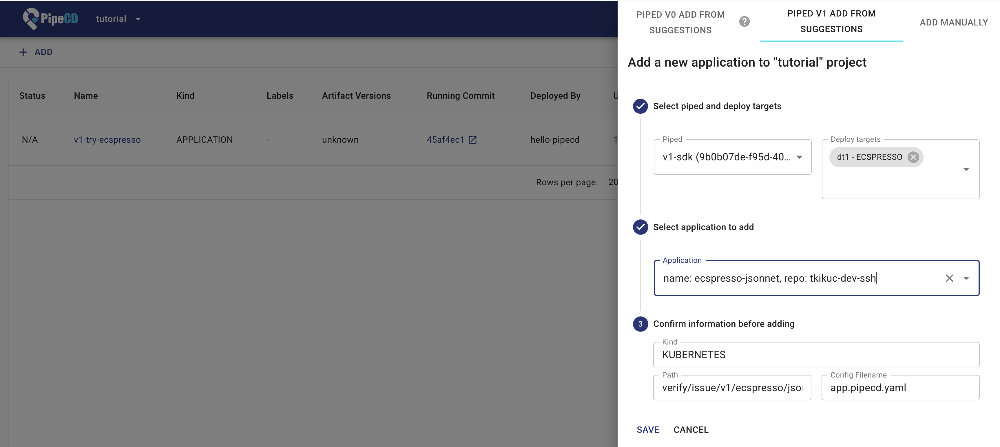

# pipecd-plugin-prototypes
[DO NOT USE IN PROD] Prototypes of PipeCD plugin for demonstration.

Tests, error handlings, logging, configs,... are poor yet.

See [Overview of the Plan for "Pluginnable" PipeCD](https://pipecd.dev/blog/2024/11/28/overview-of-the-plan-for-pluginnable-pipecd/) to understand what's PipeCD plugin.

**Note: Since interface/config of the plugin mechanism is unstable yet, the usage or code might change or not work well.**

## Temporary Usage v0.2

This is based on the upstream commit [39989f983a8988b2f50d6ee3c130ead16e19a03e](https://github.com/pipe-cd/pipecd/commit/39989f983a8988b2f50d6ee3c130ead16e19a03e). (> v0.51.0)

available for:
- [ecspresso](plugins/ecspresso) (based on the plugin SDK)

### Preparation

1. Run Control Plane with master branch of https://github.com/pipe-cd/pipecd.git
2. Create config of pipedv1 like this:

```yaml
apiVersion: pipecd.dev/v1beta1
kind: Piped
spec:
  plugins:
    - name: ECSPRESSO
      port: 7003 # Any unused port
      url: file:///<HOME>/.piped/plugins/ecspresso # Replace <HOME> to your home dir
      deployTargets:
        - name: dt1
          config: # Depends on plugin. e.g. See `EcspressoDeployTargetConfig`
            version: 2.4.5
```

To use remote binary, you can use `url: <URL>`.

### Run pipedv1 with plugins

1. Build plugins
```sh
make build/plugin
```

2. Run pipedv1

(Optionnal) If you don't have pipecd source code, clone like this:
```sh
git clone https://github.com/pipe-cd/pipecd.git
cd pipecd
```

```sh
# 'EXPERIMENTAL=true' is required for pipedv1.
# Add `INSECURE=true` when using your local Control Plane etc.
make run/piped CONFIG_FILE=<YOUR_PIPED_V1_CONFIG_FILE> EXPERIMENTAL=true
```

3. Create and push an app config file like this:

```yaml
apiVersion: pipecd.dev/v1beta1
kind: Application # Set "Application" for v1!
spec:
  name: v1-try-ecspresso
  input: # Depends on plugin
    config: ecspresso.yml # Additionally you need to prepare ecspresso.yml
  pipeline:
    stages: # Define your stages
      - name: ECSPRESSO_DIFF
      - name: ECSPRESSO_DEPLOY
```

4. Register the new app on UI via `PIPED V1 ADD FROM SUGGESTIONS`



5. Deployment will be triggered!!

## Temporary Usage v0.1

This is based on the upstream commit [4afa3e61937502fd95614889cbd8294dd794fcd6](https://github.com/pipe-cd/pipecd/commit/4afa3e61937502fd95614889cbd8294dd794fcd6). (< v0.51.0)

available for:
- [cdk](plugins/cdk)
- [ecschedule](plugins/ecschedule)
- [lambroll](plugins/lambroll)
- [sakura-apprun](plugins/sakura-apprun)

### Preparation

1. Run Control Plane with master branch of https://github.com/pipe-cd/pipecd.git
2. Run pipedv0
3. Register any one app with pipedv0 on UI and deploy it
   1. Because pipedv1 cannot register an app yet...
   2. _Note: Do not specify plugin config in app.pipecd.yaml yet._
4. Create config of pipedv1

Example configuration (v0 and v1 compatible):
```yaml
apiVersion: pipecd.dev/v1beta1
kind: Piped
spec:
  # v0 config for registering an app
  platformProviders:
    - name: terraform-dev
      type: TERRAFORM # Any type will be OK because this will be ignored in v1.

  # v1 config for plugins
  plugins:
    - name: ECSPRESSO
      port: 7003 # Any unused port
      url: file:///<HOME>/.piped/plugins/ecspresso # Replace <HOME> to your home dir
      deployTargets: # This is requried if this plugin requires `config`.
        - name: dt1
          config:
            version: 2.4.5
```

To use remote binary, you can use `url: <URL>`.
I want to release prototype plugin binaries in this repo soon...

### Run pipedv1 with plugins

_Note: Set `PipelineStage.Visible: true` for stages to show in the v0-UI._

1. Build plugins
```sh
make build/plugin
```

2. Run pipedv1

(Optionnal) If you don't have pipecd source code, clone like this:
```sh
git clone https://github.com/pipe-cd/pipecd.git
cd pipecd
```

```sh
# 'EXPERIMENTAL=true' is required for pipedv1.
# Add `INSECURE=true` when using your local Control Plane etc.
make run/piped CONFIG_FILE=<YOUR_PIPED_V1_CONFIG_FILE> EXPERIMENTAL=true
```

3. Override the app config

Example of new app config:
```yaml
apiVersion: pipecd.dev/v1beta1
kind: Application # In the new config, this can be 'Application'.
spec:
  name: v1-try-ecspresso
  input: # Depends on plugin
    config: ecspresso.yml
  pipeline:
    stages: # Define your stages
      - name: ECSPRESSO_DIFF
      - name: ECSPRESSO_DEPLOY
```

4. Push the app config  -> A new Deployment will be triggered!!

